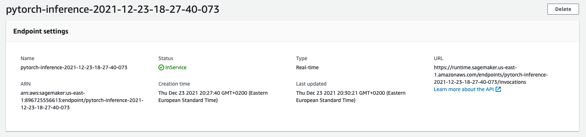

# Udacity ML Nanodegree Project 3 
## Dog breed Classification with AWS Sagemaker
### intro:
In this project, we use AWS Sagemaker to finetune a pretrained model in Pytorch to detect dog breeds by image classification. We use Sagemaker profiling, debugger, hyperparameter tuning. 

## Dataset
The dataset used in this project is available at [dogImages](https://s3-us-west-1.amazonaws.com/udacity-aind/dog-project/dogImages.zip). The dataset contains images from 133 dog breeds divided into training, testing and validation datasets.

## PyTorch pretrained model
We use **ResNet50** as our pretrained model with depth of 50 layers to classify the dataset. 

## Project environment setup
The project is done in Sagemaker Jupyter notebook. The dependencies such as `smdebug` and `torch` are installed. The dataset if downloaded and unzipped and loaded to a bucket in S3 for further access. 

## hyperparameter Tuning
To select the best hyperparameter for our training model, we use a range of hyperparameters and execute multiple training jobs with different hyperparameters. The hyperparameter of the best tuner (with the least loss score) is used for training a classification model.

## fitting an estimator with profiling and debugging settings
To train a classification model, we add a profilier which logs a collection of performance metrics during the training and inference. We also add a debugging configuration to help developing better models by catching anomalies while training models. The fitted model will be used for deployment.

We set a debugger hook to record the *Loss Criterion* of the process in both **training** and **validation**. The plot below shows the cross entropy loss for the training and validation processes.

## Deployment
The deployment of model is done via creating an **endpoint**. SageMaker provides an HTTPS endpoint where the machine learning model is available to provide inferences (predicting dog breed in our case).

## Test the model
To check if the model works correctly, a user can communicate with the endpoint by sending a HTTPS request with a image of a dog in bytes format. The response is a list of 133 diffrent float numbers as prediction of 133 diffrenet dog breed classes. The index of highest prediction in the list is used as the index of the list of the dog breeds. 
The figure below is a snapshot of the cloudwatch logs for a request and it's reponse.

## Scripts 
The following files are included for the project:
- `hpo.py` for tuning the model with a range of hyperparameters and finding the best training job.
- `train_model.py` for using the hyperparameters of the best training job that generated by `hpo.py`.
- `inference.py` to deploy the endpoint with preprocessing, prediction and post processing.

## The steps for the image classification in this project:

1. First we download the dataset. 
2. unzip the folder
3. check the content
4. upload the folder to S3
5. create a hyperparameter tuning range for ResNet50 retrained model.
6. run tuner.fit() with entry point of hpo.py (configuration of the Resnet, training and testing the model with the givern hyperparameters)
7. get the hyperparameter of the best training job in tuner.
8. add profiling and debugging to the train model for logging info in cloudwatch
9. use the hyperparameters of the best training job and run estimator with model_train (train a new model with the given hpo)
10. plot the output 
11. use the estimator for deploying an endpoint that predicts the dog breed from the train model.
12. select a test image and call the endpoint with the test image.
13. check if the model predict the dog breed accurately. 
